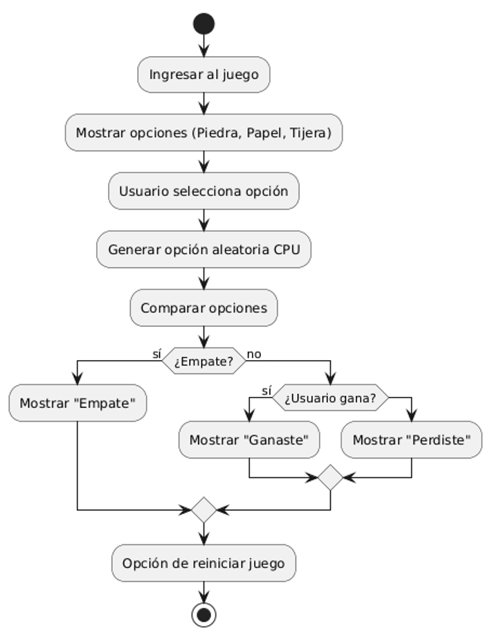
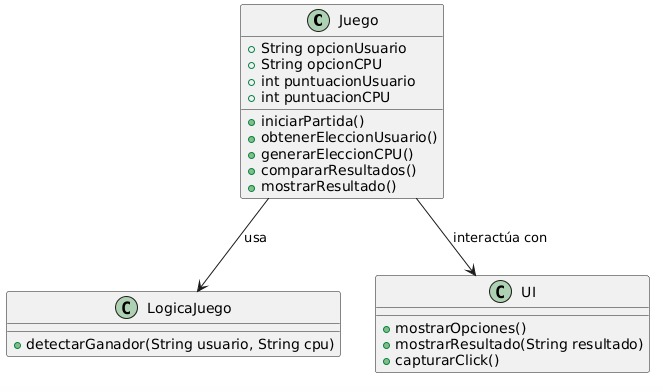

TEMA Piedra, Papel o Tijera

Integrante
DAMARIS MIKAELA PILA JARA

Materia
Lógica de Programación

Objetivo del sistema

Desarrollar un juego de Piedra, Papel o Tijera donde el usuario pueda jugar contra la computadora de manera sencilla. Con este proyecto se busca aplicar la lógica de programación mediante decisiones, condiciones y generación de resultados aleatorios, ofreciendo una experiencia fácil de usar y entendible.

Descripción de funcionalidades

El sistema desarrollado cuenta con las siguientes funcionalidades:

Interfaz gráfica amigable e intuitiva
Selección de las opciones Piedra, Papel o Tijera mediante botones
Generación aleatoria de la jugada de la computadora
Comparación automática entre la elección del jugador y la de la computadora
Determinación del ganador de cada ronda
Actualización automática del marcador de puntos
Opción para reiniciar la partida
Diseño adaptable para una mejor visualización en diferentes tamaños de pantalla

Fecha
27 de junio de 2026

Documento del Proyecto
Introducción

La lógica de programación es una base fundamental en la resolución de problemas, ya que permite organizar pasos, tomar decisiones y definir condiciones de manera clara.

En este proyecto se desarrolló el juego de Piedra, Papel o Tijera, el cual permite aplicar conceptos básicos de lógica como estructuras condicionales, toma de decisiones y generación de valores aleatorios. El sistema permite que el usuario juegue contra la computadora, la cual genera una opción de forma automática, y luego se comparan los resultados para determinar un ganador.

El objetivo principal fue reforzar el pensamiento lógico mediante la creación de un sistema sencillo pero funcional.

Descripción del problema

Muchas aplicaciones sencillas ayudan a practicar programación porque permiten aplicar lógica, trabajar con el usuario y manejar decisiones. Aunque este tipo de juegos parecen simples, implican resolver problemas como generar elecciones aleatorias, comparar resultados y actualizar información en pantalla.

El objetivo del proyecto fue crear un juego sencillo donde el usuario pueda jugar contra la computadora de forma automática, organizando correctamente la lógica para que el sistema funcione de manera clara y entendible.

Relación con los contenidos de la asignatura

Durante el desarrollo del proyecto se aplicaron contenidos básicos de lógica de programación, como el uso de condiciones, toma de decisiones y estructuras lógicas para resolver problemas.

También se trabajó con variables para almacenar información y con la generación de valores aleatorios para simular las jugadas de la computadora.

Además, se reforzó el uso de comparaciones y operadores lógicos para determinar el resultado del juego entre el usuario y la máquina.

Explicación del sistema desarrollado

El sistema consiste en un juego donde el usuario puede seleccionar una de las tres opciones disponibles: Piedra, Papel o Tijera.

Una vez realizada la selección, la computadora genera automáticamente una elección aleatoria. Luego, el sistema compara ambas opciones aplicando las reglas del juego para determinar si el usuario gana, pierde o empata.

Cada resultado actualiza el marcador mostrado en pantalla. También existe una opción para reiniciar la partida y comenzar nuevamente desde cero.

Reflexión sobre el impacto de la tecnología

La lógica de programación es importante porque ayuda a resolver problemas de forma ordenada, usando pasos y decisiones claras. Este proyecto permitió aplicar estos conocimientos de manera práctica.

Durante su desarrollo se reforzaron habilidades como el análisis de problemas, la toma de decisiones y el uso de condiciones para obtener resultados correctos.

También se entendió la importancia de planificar bien la lógica antes de programar, ya que esto facilita la creación de soluciones más claras.

Tecnologías utilizadas
HTML5
CSS3
JavaScript
Visual Studio Code
Estructura del proyecto
Piedra_Papel_Tijera
│
├── index.html
├── style.css
├── script.js
└── README.md
Cómo ejecutar el proyecto
Descargar o clonar el repositorio
Abrir la carpeta del proyecto
Ejecutar el archivo index.html en el navegador

También puede abrirse con Visual Studio Code usando la extensión Live Server.

Conclusión

El desarrollo de este proyecto permitió aplicar los conocimientos de lógica de programación de manera práctica mediante la creación del juego Piedra, Papel o Tijera.

Se logró implementar la lógica del juego usando condiciones, decisiones y manejo de resultados, obteniendo un sistema funcional y fácil de entender.

Este proyecto ayudó a reforzar el pensamiento lógico y la capacidad de resolver problemas paso a paso.

DIAGRAMA DE CASOS DE USO 

DIAGRAMA DE FLUJO DEL SISTEMA

DIAGRAMA DE ARQUITECURA 

